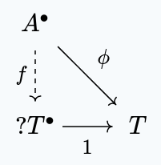

This note is about the discrete topology $X^{\bullet}$ and
indiscrete topology $X_{\circ}$ on a set $X$.

Namely, $-^{\bullet}$ and $-_{\circ}$ are functors $\bold{Set} \to \bold{Top}$
with the following adjunctions with the forgetful functor $? : \bold{Top} : \bold{Set}$

$$
\bullet \vdash ? \vdash \circ
$$

As a reminder, the discrete topology contains all subsets of $X$

$$
\mathcal{T}^{\bullet} := \{U \ |\  U \subseteq X \}
$$

The indiscrete topology contains only the empty set, and all of $X$:

$$
\mathcal{T}_{\circ} := \{\emptyset, X\}
$$

> [!note] **Note:**
> I like this notation, since the $\bullet$ denotes that the
> discrete topology is nice and full of sets. The $\circ$ denotes
> that the indiscrete topology is empty and devoid of any sets.

It's clear that $\mathcal{T}_{\circ}$ is the *coarsest* topology on $X$,
and $\mathcal{T}^{\bullet}$ is the *finest* topology on $X$. Formally,
for any other topology $\mathcal{T}$ on $X$, we have:

$$
\mathcal{T}_{\circ} \subseteq \mathcal{T} \subseteq \mathcal{T}^{\bullet}
$$

This is a very *structural* point of view, focusing on different topologies
we can apply to $X$. We can shift our view to an *external* point of view,
focusing on what continuous maps exist on the *spaces* $X^{\bullet}$
and $X_{\circ}$.

# Discrete Topology

The discrete space $X^{\bullet}$ on a space $X$ can be characterized as follows.
Any set function $X \to Y$ is continuous, provided $Y$ is a topological space.

### Proof

Since every set of $X^{\bullet}$ is open, every pre-image $f^{-1}(V)$
of an open set $V$
is also open, so $f$ is open.

As a simple corollary, since we have $1 : X \to X$, we can see that $X^{\bullet}$
is finer than all other topologies on the same set.

## As a functor

Because of this property, we see that $-^{\bullet} : \bold{Set} \to \bold{Top}$
is a functor,
sending a set $X$ to the discrete topological space $X^{\bullet}$.
Set functions $f : X \to Y$, are already continuous functions $X^{\bullet} \to Y^{\bullet}$,
because of the characterization we went over. The composition laws
clearly hold, since functions are left untouched.

With this in mind, we have an even more powerful characterization:

For any set $X$, the space $X^{\bullet}$ is initial in the category $X \downarrow ?$,
where $?$ is a forgetful functor $\bold{Top} \to \bold{Set}$.

More concretely, we have this situation:

Given any set function $f : X \to ?T$, where $T$ is a topological space,
there exists a unique continuous map $\varphi! : X^{\bullet} \to T$ such
that the following commutes:

### Proof

$X^{\bullet}$ satisfies this property. 
For each point $x \in X$,
we need $f(x) = (\varphi! \circ id)(x) = \varphi!(x)$,
so we have no choice but $f$. Since $X^{\bullet}$
is discrete, $f$ is necessarily continuous.

$\square$

### Intuition

$X^{\bullet}$ is a way of creating a topological
out of $X$ such that every set function out of $X$
becomes continuous.

## Dual Property

Another property is that $?T$ is terminal in the slice category
$-^{\bullet} \downarrow T$:

Given any set $A$ and continuous map $\phi : A^{\bullet} \to T$,
there exists a unique set function $f : A \to ?T$ such that
this diagram commutes:

### Proof

We need $f(a) = \phi(a)$, so $f$ is uniquely determined as $\phi$.

$\square$

With these two diagrams in place, we have an adjunction:

$$
\bullet \vdash ?
$$

# Indiscrete Topology

Any function $T \to X_{\circ}$ is continuous, since the only
open sets are $\emptyset$ and $X$, whose preimages are
$\emptyset$, and $T$ respectively.

$X_{\circ}$ is terminal in $? \downarrow X$.

If $T$ is a topological space with a set function $f : T \to X$,
then there exists a unique continuous map $\varphi! : T \to X_{\circ}$
such that the following diagram commutes:

### Proof

We have, once again, no choice but $\varphi! = f$. This
function is continuous, since any function to $X_{\circ}$
is continuous.

### Intuition

This is really just a repetition of the fact that
every set function $\to X$ becomes a continuous map $\to X_{\circ}$.

## Dual Property

We have a similar dual property as before.

$?T$ is initial in $T \downarrow -_\circ$.

Given some set $A$ with a continuous map $\phi : T \to A_\circ$,
there exists a unique set function $f! : ?T \to A$
making the following commute:

### Proof

We necessarily have $f!(t) = \phi(t)$.

These two properties form an adjunction:

$$
? \vdash \circ
$$

# Combining it all

Looking at both of these in unison, we have the following adjunction:

$$
\bullet \vdash ? \vdash \circ
$$

So, $\bullet$ is the typical left adjoint Free functor,
and $\circ$ is a right adjoint Co-Free functor. So these
two constructions are naturally dual to eachother.

$bullet$ allows us to make a topological space so that
mapping out of the space is always continuous,
and $\circ$ allows us to make a topological space so
that mapping into the space is always continuous.

Furthermore, these defining properties are *characteristic*,
so any space satisfying these properties must be homeomorphic.