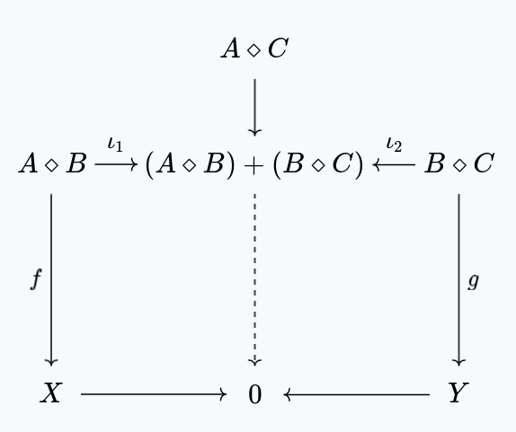

# Advantage Growth

One thing I've realized is that the correct relation between advantages
is that to have a reduction $f : G \to G'$, you need to have:

$$
p(\lambda)\text{Adv}[G', \mathscr{A}_f] \geq \text{Adv}[G, \mathscr{A}]
$$

for some polynomial $\lambda$,
for all adversaries $\mathscr{A}$, with $\mathscr{A}_f$ being the wrapped
adversary induced by the morphism of games.

This is the most general relation satisfying $\text{Adv}[G', \mathscr{A}_F]$ negligible
$\implies \text{Adv}[G, \mathscr{A}]$ negligible, which is really the only
notion we care about.

Naturally, this composes as well.

# The Unwinnable Game

We can define an unwinnable game as one with trivial messages,
where the advantage is a negligible function of $\lambda$.

This has the nice property that the statement:
$A \to 0$, is equivalent to saying the the game $A$ is secure.
This lets us derive nice things categorically, such as:
$A \to 0, B \to 0 \implies A + B \to 0$, which follows directly
from the universal property of the coproduct!

If you do some shenanigans, you can show that this object is *initial*.
To do this, you need to fake messages, which you can do by simply
sampling them at random, but this imposes additional assumptions
on the structure of games.

# Identical Games, Isomorphic Games

Two games are isomorphic in the natural category-theoretic definition.
This means that there are reductions $A \to B$ and $B \to A$, which compose
in both ways to make the identity function.

Two games share the same interface if their message types are the same.

We can say that two games $A$ and $B$ are *identical* when they share
the same interface, and their responses are always the same for each query.

One common proof of technique is to look at two games, and then assert they're
actually the same game. This is usually asserting that $A$ and $B$ are
identical, or $A = B$.

## Induced Game

A morphism between games $f$ is really a set of data used to bridge
the two interfaces together. We've used this to make an induced adversary
$f$, but you can also use it to make an induced game $B_f$, from
a morphism $A \to B$. We can rephrase things in terms of the induced game too.
I.e. for a reduction, we require:

$$
p(\lambda)\text{Adv}[B_f, \mathscr{A}] \geq \text{Adv}[A, \mathscr{A}]
$$

This is useful with the technique of identical games, because in many situations
we can create a reduction $A \to B$ by creating a morphism $f$,
and then showing that $B_f = A$. This lets us move state, like random oracles,
into a wrapper we control, which is very useful.

# Distinguishing Game

Given two games with the same interface, we can define the game:
$A \diamond B$. We start by flipping a coin $b \xleftarrow{R} \{0, 1\}$,
and then playing one of the two games based on that coin. We then
have two conditional distributions, based on the value of this coin,
and the advantage becomes:

$$
|\text{Adv}_A(P[C^A\_{N+1}|b=0]) - \text{Adv}\_B(P[C^B\_{N+1} | b=1])|
$$

For example, the bit flipping version of semantic security is of this form.

Often, we formulate a security property in terms of two games, and show
that $A \diamond B \to 0$

One thing that I feel is true, but haven't proven entirely rigorously is that:

$$
A \cong B \iff A \diamond B \to 0
$$

But this should absolutely be true.

## Difference Lemma

A common technique to show $A \diamond B \to 0$ is to show that the execution
of $A$ and $B$ are the same, except if some event $Z$ happens. This naturally
creates the conditions to show that the difference in advantages is negligible,
since the difference probability distributions are bounded by the likelihood of $Z$
hot happening.

I'm not sure of a generic way to prove this, as it depends a lot on the particulars
of a situation, and is a very internal property. Perhaps there is a way to externalize
it.

## Hybrid Arguments

Often, we want to prove $A \diamond C \to 0$, but we do so in two steps,
first by proving $A \diamond B \to 0$, and $B \diamond C \to 0$, and
then gluing those two together. The typical way this is done is by using:

$$
|\text{Adv}\_A - \text{Adv}\_C| \leq |\text{Adv}\_A - \text{Adv}\_B| + |\text{Adv}\_{B} - \text{Adv}\_{C}|
$$

Usually, this hybrid argument and triangle lemma application are repeated.
There's actually a way to abstract over this.

To do this, we need to use a little result:

$$
A \diamond C \to (A \diamond B) + (B \diamond C)
$$

Since they all share the same interface, there's clearly a *morphism*
$A \diamond C \dashrightarrow A \diamond B$ and $A \diamond C \dashrightarrow B \diamond C$,
the question is whether or not the advantages work out. For this,
note that for $(A \diamond B) + (B \diamond C)$, the advantage is:

$$
\max(|\text{Adv}_A - \text{Adv}_B|, |\text{Adv}_B, \text{Adv}_C|)
$$

Now clearly:

$$
|\text{Adv}\_A - \text{Adv}\_C| \leq |\text{Adv}\_A - \text{Adv}\_B| + |\text{Adv}\_{B} - \text{Adv}\_{C}|
$$

But we also have:

$$
|\text{Adv}\_A - \text{Adv}\_B| + |\text{Adv}\_{B} - \text{Adv}\_{C}| \leq 
2 \cdot \max(|\text{Adv}_A - \text{Adv}_B|, |\text{Adv}_B, \text{Adv}_C|)
$$

So we do indeed have a reduction, using the fact that $2$ is polynomial
in $\lambda$. This is why it's important to have that definition
of reduction!

This naturally generalized to multiple differences, instead of just two.

Then, usually, we have two games, $X$, $Y$, which we assume to be secure,
and then reductions $A \diamond B \to X$, and $B \diamond C \to Y$.

The security of $A \diamond C$ then follows using the above lemma
and categorical diagram chasing:

