"Free" constructions are abundant in Algebra, and are actually examples
of *Adjunctions*. Specifically, we have an adjunction:

$$
\bold{Set} \xtofrom[?]{F} \bold{Alg}
$$

Where $F : \bold{Set} \to \bold{Alg}$ is the *free functor* from
the category of sets to this category of algebraic structures,
and $? : \bold{Alg} \to \bold{Set}$ is the *forgetful functor*,
which forgets the additional algebraic structure.

Usually, this universal construction is presented a bit differently,
but is equivalent to the notion of adjunction.

## Free Groups

As a concrete example, take Free Groups. Given a set $A$,
the free group $F A$ is usually defined with a universal property:

There is a group $F A$, and a set function $\eta : A \to F A$ such that for
any other group $G$ and function $g : A \to G$, there exists a unique
group homomorphism $\varphi! : F A \to G$ making the following diagram commute:

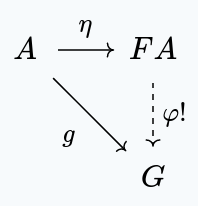

Of course, when talking about the interaction of morphisms and objects
from $\bold{Grp}$, we really mean their *images*,
under the forgetful functor $? : \bold{Grp} \to \bold{Set}$. Being explicit,
we get the following diagram:

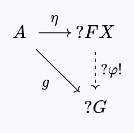

We can characterize this object $F A$ as being an initial 
object in the slice category $A \downarrow ?$ (where $A : 1 \to \bold{Set}$
is the functor sending every object to $A$, and every morphism to $1_A$).

The objects consists of a choice of group $G$ and set function $A \to ?G$,
and the morphisms are group homomorphisms $G \to H$ making the following
diagram commute.

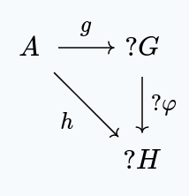

It's clear that the initial object in this category is the free group
$F A$, along with the morphism $\eta : A \to ? F A$.

## Adjunctions

It turns out that this characterization is implied by the adjunction:

$$
F \dashv \ ?
$$

The "primal" characterization of an adjunction $L \dashv R$ is that
there exists a
special binatural isomorphism between the two functors:

$$
\mathcal{D}(L -, -) \cong \mathcal{C}(-, R -)
$$

A more convenient (and entirely equivalent) characterization
is that of two natural transformations:

$$
\begin{aligned}
\eta : 1 \Rarr R L \cr
\epsilon : L R \Rarr 1
\end{aligned}
$$

Satisfying these two relations:

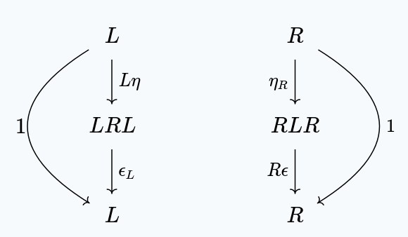

which we call the left and right "zig-zag identities".

> [!note] **Note:**
> I use the notation $\alpha_F$ to denote the natural transformation
> whose component for the object $A$ is $\alpha_{F A}$.
> 
> Similarly, $G \beta$ denotes the natural transformation whose component
> at $B$ is $G \beta_B$.

### Implying the Universal Property

With this adjunction in place, we can show
that $(L A, \eta_A)$
is the initial object in the comma category $A \downarrow R$,
for any object $A$.

This is a fun series of diagram chases.

First, we show that there is a morphism
to the other objects in the comma category.
Given $(M, f : A \to R M)$ some other object in $A \downarrow R$,
we provide a morphism $\varphi : L A \to  M$
such that this diagram commutes:

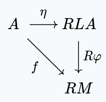

Applying the right zig-zag identity at $M$, we get this commuting diagram:

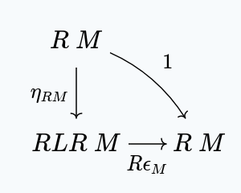

We can compose this with $f$ to get:

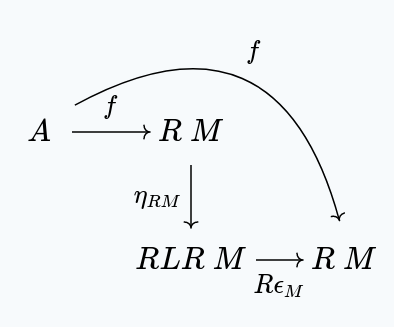

But then, by naturality of $\eta$, we have:

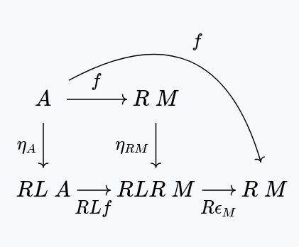

And then $L f \ggg \epsilon_M$ is our $\varphi$.
Since $R$ is a functor $RL f \ggg R \epsilon_M = R (L f \ggg \epsilon_M)$

> [!note] **Note:**
> In the specific case of a free group, $L f = F f$
> works by preserving all of the free algebraic operations
> we've created, but swapping out the "seeds" we've used.
> Then we interpret these free operations as concrete
> operations in $M$, using $\epsilon$.

Next, we show that this function is unique. In other words,
if $\phi : L A \to M$ with $\eta_A \ggg R \phi = f$, then $\phi = \varphi$.

We start with:

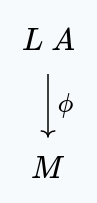

Then, we apply the left zig-zag identity, to get:

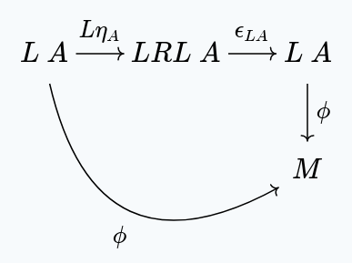

By naturality of $\epsilon$, we get:

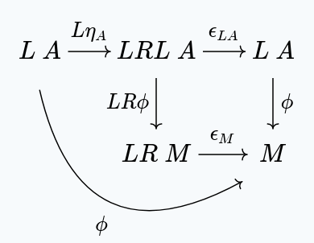

But, since $\eta_A \ggg R \phi = f$, we have:

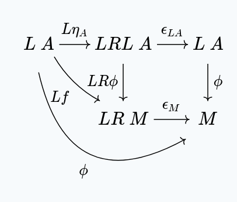

But, by definition $\varphi = L f \ggg \epsilon_M$, giving us:

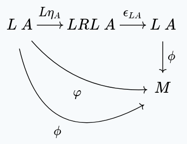

In other words $\varphi = \phi$.
  
## The Dual Construction

If we take the opposite functors $L^{op} : \mathcal{C}^{op} \to \mathcal{D}^{op}$
and $R^{op} : \mathcal{D}^{op} \to \mathcal{C}^{op}$, we have:

$$
R^{op} \dashv L^{op}
$$

Using our previous result, we get that for any object $M$ in $\mathcal{D}^{op}$,
$(R^{op} M, \epsilon_M : M \leftarrow LR\ M)$
is initial in the slice category $M \downarrow L^{op}$

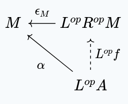

Of course, this is the same thing as saying that $(R M, \epsilon_M)$ is *terminal*
in the slice category $L \downarrow M$. In other words, for any
object $A$ in $\mathcal{C}$, with a morphism $\alpha : L A \to M$ in $\mathcal{D}$,
there exists a unique $f : A \to R M$ such that this diagram commutes:

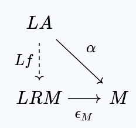

### Concretely

Back to the example of free groups, we have the following situation:

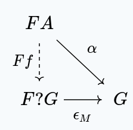

Ultimately, this just expresses the fact that a group homomorphism
out of a free group consists first of replacing each of the seeds
with an element of $G$, and then reducing the free algebraic structure
using $\epsilon$.

# The Other Direction

We can also go in the other direction. 
Let $L : \mathcal{C} \to \mathcal{D}$, $R : \mathcal{D} \to \mathcal{C}$
be functors. If we have
parameterized functions (which we don't yet assume to be natural)
$\eta_A : A \to RL \ A$ for any object $A$ in $\mathcal{C}$,
and $\epsilon_M : LR \ M \to M$ for any object $M$ in $\mathcal{M}$,
such that $(L A, \eta_A)$ is initial in $A \downarrow R$,
and $(R M, \epsilon_M)$ is terminal in $L \downarrow M$, then
we have an adjunction:

$$
L \dashv R
$$

First, $\eta$ is natural:

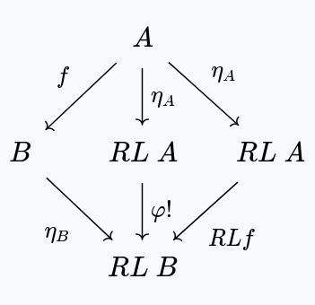

The right and left triangles both commute, since they
make use of the unique $\varphi!$ that must exist
whenever we have a function $A \to R M$, for some $M$.

Secondly, $\epsilon$ is natural:

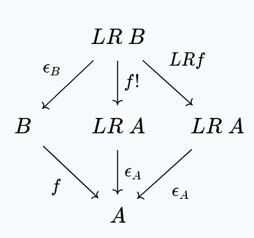

The left and right triangles both commute, making use
of the universal property of $LR \ A$. (The argument is similar
to before, of course).

Now, for the zig-zag identities.

Let's start with the right zig-zag identity, for some object $M$:

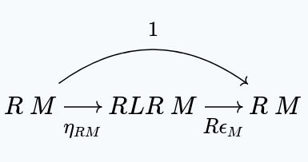

If we take $1 : R \ M \to R \ M$, we have a unique $\varphi!$ such that:

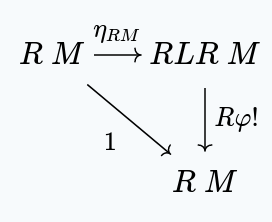

by the universal property for $RL$.

For any $\varphi : LR \ M \to M$, we have a unique $f!$ such that:

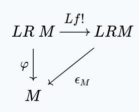

by the universal property for $LR$.

Combining the first diagram, with the image under $R$ of the second,
we get:

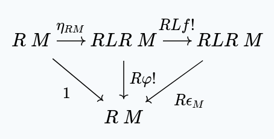

But, $Lf! \ggg \epsilon_M$ satisfies the universal property
of $\varphi!$, which is unique. This means that $\varphi = Lf! \ggg \epsilon_M$.

We then have:

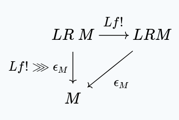

But clearly, $1$ satisfies the universal property of $f!$ in this situation,
which means $f! = 1$. This gives us:

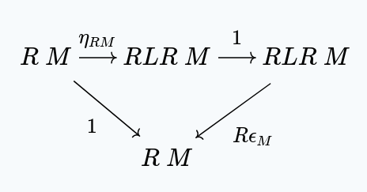

And so the right zig-zag property is satisfied.

For the left zig-zag property, we use the same strategy.

Given any object $A$, in $\mathcal{C}$ we want to show:

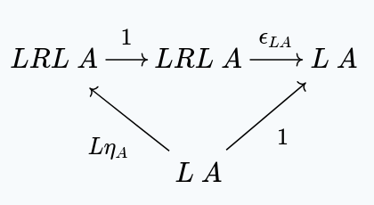

We have the following diagram:

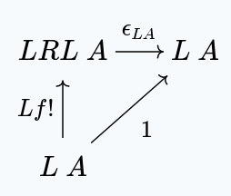

With the unique $f!$ satisfying this diagram existing
because of the universal property of $LR$.

Similarly, for *any* $f$, we have:

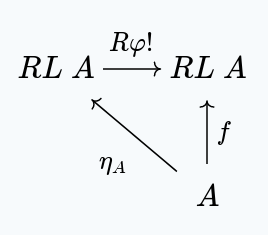

because of the universal property of $RL$.

Combining both diagrams, we get:

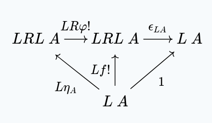

A similar argument as last time shows us first that $f! = \eta \ggg R\varphi!$,
and then $\varphi! = 1$, giving us:

and so the left zig-zag property is satisfied.

# Conclusion

Given functors $L : \mathcal{C} \to \mathcal{D}$ and $R : \mathcal{D} \to \mathcal{C}$,
these statements are equivalent:

1. $L \dashv R$
2. $\mathcal{D}(L -, -) \cong \mathcal{C}(-, R -)$
3. There exist $\eta : 1 \Rarr RL, \ \epsilon : LR \Rarr 1$ satisfying the zig-zag identities
4. ($\forall A \in \mathcal{C}, M \in \mathcal{D}$) $(RL A, \eta_A)$ is initial in $A \downarrow R$,
   and $(LR M, \epsilon_M)$ is terminal in $L \downarrow M$.

In this post, I only proved $3 \iff 4$. $1 \iff 2$ by definition, and $2 \iff 3$ is well
known.