This post is a basic introduction to the idea of *Categorical Graphs*, or just the standard theory
of Graphs, developed through the lens of Category Theory, and generalized in the obvious ways
that follow through that lens. This is just an introduction mainly because this theory doesn't
seem to have been developed very far yet, and I haven't been able to develop it that much independently
so far. I think I have a good grasp on some very basic ideas here, and wanted to present them while
they're still fresh in my head.

# The basic idea

The starting point will be a standard definition of a Graph. There's no single agreed upon definition
for what exactly a Graph is, but one non-controversial one would be:

A Graph $(V, E)$ is a set of *vertices* $V$, and a list of (directed) *edges* $E \subseteq [V \times V]$.
We need a list to be able to have multiple edges between two vertices.

So, this graph:

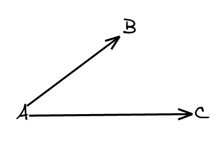

could be represented as $(\{A, B, C\}, [(A, B), (A, C)])$. Each of the points in the diagram
becomes an element of the set of vertices, and each edge in the graph becomes a pair $(v, v')$.
Note that the *order* of the pair does matter, because we're dealing with a directed graph. The first
element of the pair is the *source* vertex, and the second element of the pair the *target* vertex. With
that in mind, a pair like $(A, B)$ denotes the arrow connecting $A$ to $B$ in the graph.

A first generalization of this is allow the edges to be any set whatsoever. After all, the only property
we're using is that each edge needs to have a source vertex and a target vertex associated with it,
and that multiple edges are allowed. Instead of having $E$ be a list of pairs, making the source and target
assignment implicit, we could instead let $E$ be *any set*, and also require *explicit* source and target
assignments. With this in mind, our new definition becomes:

A Graph is a tuple $(V, E, s : E \to V, t : E \to V)$. $V$ is the set of vertices, $E$ is the set of edges,
and $s, t$ are functions assigning each edge to its source and target vertex, respectively.

Going back to our example graph, this is encoded as $(\{A, B, C\}, \{1, 2\}, s, t)$ with:

$$
s(1) = A \newline
s(2) = A \newline
t(1) = B \newline
t(2) = C
$$

The standard encoding of edges as ordered pairs fits perfectly into this paradigm. $s$ and $t$ become
$\pi_1, \pi_2 : V \times V \to V$, mapping an ordered pair to its first or second element.

## Diagrams

Now we're going to turn up our level of abstraction *slightly*. Instead of thinking of a Graph as
4 separate things: two sets, and two functions, we're going to look at this as a single piece in
the larger category of sets $\bold{Set}$. This category has objects *sets*, and as morphisms
*functions* between them. A graph then becomes a *diagram* in this category, or a small piece of it:

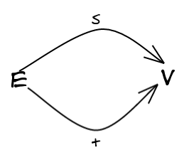

A given graph picks out two objects in $\bold{Set}$, and two parallel arrows connecting one object
to the other. These arrows are the source and target functions, respectively.

## Functors

This definition of a diagram as a "small piece" is a bit inaccurate, really. A way to make this precise
is use the notion of a *Functor* from a template category, with the right shape. The shape we want is
two objects, and two parallel arrows between them. We'll call our template category $\text{ST}$ (for source / target):

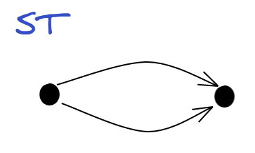

A Graph is then nothing more than a Functor $\text{ST} \to \bold{Set}$!

# The Category of Graphs

Because Functors are a well known thing in Category Theory, we can immediately use a bunch of their properties,
and constructions we expect to exist, in order to define the **category of Graphs**!

## Natural Transformations and Graph Homomorphisms

There's already a notion of a *morphism* between Functors: the *natural transformation*. Recalling the definition, a natural transformation
$F \Rarr G$ consists of of a morphism $\alpha_x : F x \to G x$ in the *target* category, for each object
in the *source* category. Furthermore, this morphism *commutes* with other morphisms originating in the source category:

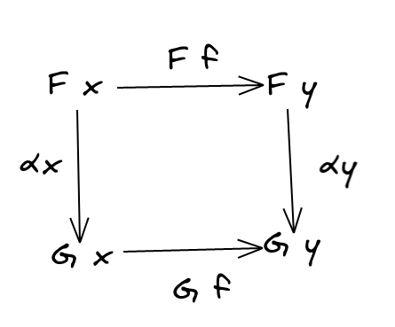

This diagram commutes for any objects $x, y$ and morphisms $f : x \to y$ between them.

A graph homomorphism between two Graphs (Functors) $G, H$ is then a *natural transformation* between them.
Because the template category $\text{ST}$ only has two objects and morphisms, we actually only need two commuting diagrams:

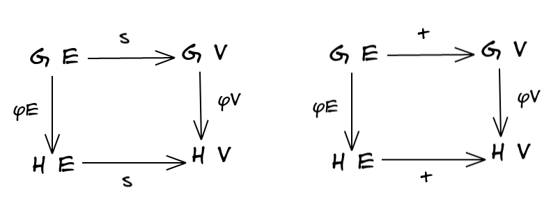

Where $\varphi$ is our natural transformation, and $s, t$ are the targets of the two morphisms in $\text{ST}$. We can make this definition
much more concrete:

A *Graph Homomorphism* $\varphi : (E_G, V_G, s_G, t_G) \to (E_H, V_H, s_H, t_H)$ consists of functions
$\varphi_E : E_G \to E_H$ and $\varphi_V : V_G \to V_H$ satisfying:

$$
\varphi_V \circ s_G = s_H \circ \varphi_E \newline
\varphi_V \circ t_G = t_H \circ \varphi_E
$$

In other words, the source and target of an edge must map to the source and target of where the edge itself maps to.

As an example, consider these two homomorphisms:

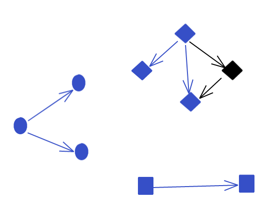

Here the image of the homomorphism is reflected in blue in the new graph. The top homomorphism
reflects the entire source graph faithfully, so it's easy to see how this is a valid homomorphism.

For the second, it's not immediately clear. But if you think about it, and verify it, you realize that this is a valid
homomorphism. Both of the target vertices end up squashed down to the same vertex, and the properties
of a homomorphism end up being satisfied.

On the other hand, something like this is not allowed:

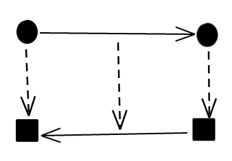

The problem in this case is that the new edge has a different source and target then the one
we need to have.

## The Category

With the notion of *homomorphism* in hand, we can define the category of graphs $\bold{Graph}$ pretty easily.
Objects are graphs, and morphisms are graph homomorphism. This notion is independent of our definition
of a graph as a functor. We could have defined homomorphisms on our initial set-based definition
of graphs, and then used those two definitions to define the category. One thing missing here is verifying
the existence of identity morphisms, and the associativity of composition of morphisms. We can avoid
redoing all of this work, because Functors and natural transformations between them form a well known category.

The category $\bold{Graph}$ is the Functor category $[\text{ST}, \bold{Set}]$.

Functor categories are well known, and have properties that can be studied more abstractly. Because of this,
I like leaning on the work already done for functors, and define the category of graphs as this functor
category directly. Of course, we should expect that a set theoretical definition could be verified
to be a category, and should be equivalent to this category.

If there's one thing to retain from this post, it's this definition of the category $\bold{Graph}$.

# Products and CoProducts

One of the interesting properties we get from having a functor category is that limits and co-limits
are inherited pretty straightforwardly from the target category. In this case: $\bold{Set}$.

## CoProduct

The CoProduct, or sum between two sets $G, H$ is actually quite simple. The new vertices are $V_G + V_H$, i.e.
a new vertex is either a vertex from $G$, or a vertex from $H$. Similarly, the edges arer $E_G + E_H$. Then the source
and target functions are defined in the natural way:

$$
s(G(e)) = s_G(e) \newline
s(H(e)) = s_H(e) \newline
t(G(e)) = t_G(e) \newline
t(H(e)) = t_H(e)
$$

they simply use the source and target functions from the right side. Concretely, this means that this new graph is simply both
previous graphs joined together with no interaction:

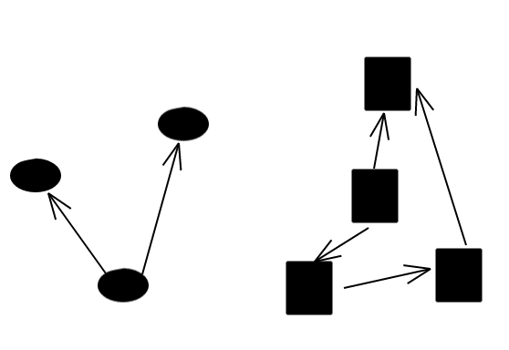

If the circles are $G$, and the squares are $H$, then $G + H$ is simply the entire picture.

## Products

Products are defined in the same way, but a bit more complicated to visualize. We have $E = E_G \times E_H$ and $V = V_G \times V_H$ and then:

$$
s(a, b) = (s_G(a), s_H(b)) \newline
t(a, b) = (t_G(a), t_H(b))
$$

A picture of this is a bit more complicated. The product of our previous two graphs looks like this:

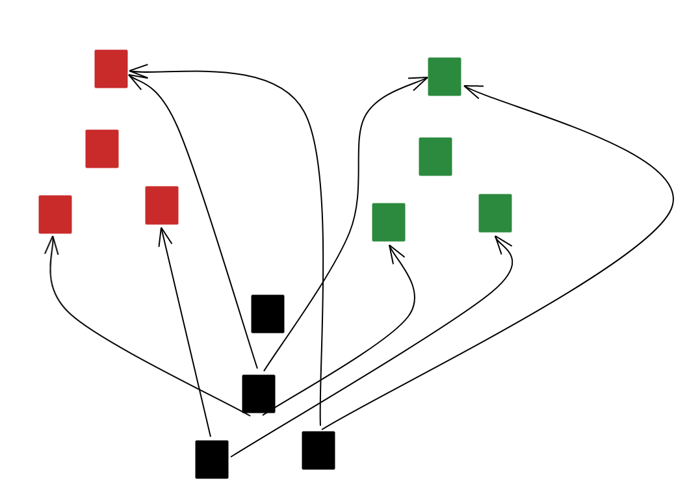

The idea is that for each vertex in $G$ (the circles), we have an entire copy of $H$. Then for an edge to exist
between two vertices, there needs to be both an edge connecting the copies in $G$, and an edge connecting the internal nodes
in $H$.

# Internal Classifiers

Our current point of view is still very object based. We've been studying examples of graphs defined
by inspecting the contents of these graphs, these objects in our category. A more categorical approach is
to treat the objects merely as labels, and to instead shift our focus on the *morphisms* of the category.

In $\bold{Set}$, instead of studying the elements of a set $S$, we study morphisms $1 \to S$. These two concepts are equivalent,
but studying the morphisms is more fruitful from a categorical point of view.

There are analogous graphs allowing us to study the vertices and edges of graphs.

Consider this single object graph:

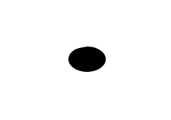

Let's call this $1$. Graph homomorphisms $1 \to H$ simply pick one of the vertices of $H$. Because of this
nice property, we can study the objects of $H$ by instead studying morphisms $1 \to H$. This is analogous
to the situation we saw earlier in $\bold{Set}$.

Now, consider this graph, which we'll call $2$:

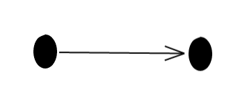

This is the graph with a single arrow connecting two vertices. Homomorphisms from this graph simply pick
out one edge of the target graph. Thus, we can study the edges of a graph $H$ through the morphisms
$2 \to H$.

# Addendum

This was just a basic introduction to some of the concepts of categorical grpahs, and there
is a lot of exploration I'd like to do at some point. One natural generalization is to consider
other target categories besides $\bold{Set}$, graphs over monoids or groups might be interesting
to consider. One major topic that I've left completely unexplored is trying to reconstruct
even the basics of graph theory and representations through this categorical lens. For example,
the adjacency list vs matrix representations of a graph likely have some kind of categorical
origin, but I'm not sure how exactly they arise quite yet. Finding a way to tread the classical
paths of graph theory in the categorical shoes is quite promising.