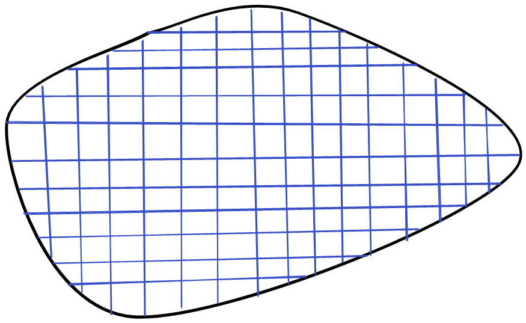
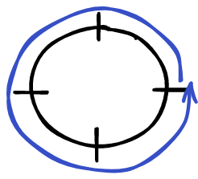
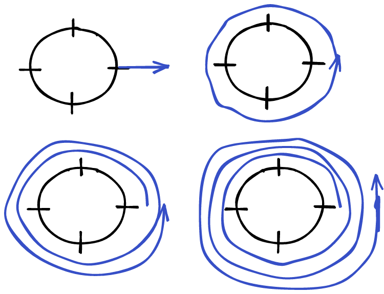

I've developed a few intuitions about algorithms on quantum computers.
This post is an attempt to share them.

<!--more-->

# Treasure in a Pond

Here's an analogy that came to me while taking a walk.
This has become my preferred example
to explain the difference between classical
computing and quantum computing.

Let's say there's a shallow pond. There's a treasure chest hidden somewhere
in the pond. The water is so murky that you can't see the chest by looking
through the water.

The classical computing approach to finding the chest is to
use a stick to prod the pond at different locations,
until you end up hitting the chest. You'll have to do a lot of prodding.
Essentially, you'll need to prod every region of the pound.

The quantum computing approach is to throw a stone in the pond, and then
observe how the ripples behave. The chest will cause a perturbation in
the ripples, revealing its location. Unlike with the prodding approach,
you only need to perform a single action to find the answer to your problem.

This analogy illustrates the difference in thinking between these models
of computation, and how quantum computing might provide an advantage
for some problems.

The key difference is that classical computing has to work
with local information. You can only prod the pond at selected points.
Quantum computing, on the other hand, can make use of global information
about the problem. At least, for some problems.
Certain problems have easily exploitable global properties.
In this situation, the chest is kind
enough to perturb the ripples in the pond.

On the other hand, if we were searching for a chest at the bottom of a lake,
our ripples wouldn't be affected at all, and we'd be back to prodding,
albeit with a longer stick.

I wrote this post for the sole purpose of getting this analogy of my chest.
The rest of this post serves to anchor this analogy through a concrete
illustration of some problems in quantum computing.

# No, you can't just try all possibilities at once

A classical bit is either $0$ or $1$. A qubit can be $\ket{0}$, or $\ket{1}$,
or, more generally, an arbitrary superposition of the two:

$$
\alpha \ket{0} + \beta \ket{1}
$$

This is true.

What is not true, however, is that you can instantly solve any classical
problem by "simply trying all possibilities at once". It is true that
you can create a superposition of all possibilities. For example,
using the Hadamard gate:

$$
\begin{aligned}
&H \ket{0} := \frac{1}{\sqrt{2}}(\ket{0} + \ket{1}) \cr
&H \ket{1} := \frac{1}{\sqrt{2}}(\ket{0} - \ket{1})
\end{aligned}
$$

You can get a superposition of all possible $n$-bit values by applying
this gate over $n$ zeroes:

$$
H^{\otimes n} \ket{0 \cdots 0} = \frac{1}{\sqrt{2}^n} \sum_{i = 0}^{n - 1} \ket{i}
$$

The problem is that if you measure this state, you don't get information
about all of these possibilities. You just sample one of these possibilities
uniformly.

If I create a super position of my inputs, apply a function, and then measure,
all I get is information about one application of the function. This is
no better than the classical case.

What allows quantum computing to gain any advantage is *interference*.
The difference between quantum superpositions and simple stochastic
variables lies in negative probabilities. A superposition can have
negative probabilities for certain states. This allows the transformation
on your superposition to cause certain states to cancel each other out.
This cancellation, crucially, will depend on the *global* properties
of the function you're applying to this superposition.

This is what allows you to use quantum computing to gain global information
about a function. If you apply your function to a superposition,
then cancellation might lead to valuable information about how that function behaves.
Of course, the function needs to be amenable to this kind of cancellation.

Back to the lake analogy, the quantum approach involves the
entire pond as input, but it can't magically prod the entire pond at once.
Thankfully, when the entire pond is shaken up, the treasure chest perturbs
the shaking in just the right way, so as to reveal its location.

The takeaway is that quantum computing can explore certain global properties
of functions
more efficiently, but requires the function involved to have a lot
of structure.

# Phase Finding

Let's move from an abstract point of view to a more concrete one.
Here, I'll try to illustrate the *phase finding* algorithm, in a conceptual
way. Going over the complete technical details would be beyond
the scope of this post, but we can taste some of the algorithm's
flavor nonetheless.

We start with some unitary operator $U$, and an eigenvector $\ket{u}$
of this operation, such that:

$$
U \ket{u} =\ \circlearrowleft(\varphi) \ket{u}
$$

> [!note] **Note:**
> Here I use the notation:
> 
> $$
> \circlearrowleft(\varphi) := e^{2 \pi i \varphi}
> $$

The phase finding algorithm takes in this eigenvector $\ket{u}$,
and returns a ket $\ket{N \varphi}$, an $N$ bit approximation
to the phase $\varphi$. By convention, we often write $\varphi$
as $0, 1, \ldots$ instead of $0, 1 / N, \ldots$.

The key to implementing this algorithm is an operation called
the *Quantum Fourier Transform* (QFT). This transformation takes a numbered
state $\ket{x}$, taken out of $N$ possible states
$\{\ket{0}, \ldots, \ket{N- 1}\}$. The result is a superposition
of states, with a tweaked phase based on $\ket{x}$:

$$
\ket{x} \mapsto \frac{1}{\sqrt{N}} \sum_{y = 0}^{N - 1}
\circlearrowleft \left(\frac{xy}{N}\right) \ket{y}
$$

For example, if we have $4$ states, then the transformations look like
this:

$$
\begin{aligned}
\ket{0} &\mapsto \frac{1}{\sqrt{4}}(\ket{0} + \ket{1} + \ket{2} + \ket{3}) \cr
\ket{1} &\mapsto \frac{1}{\sqrt{4}}(
  \ket{0} + \circlearrowleft(1 / 4) \ket{1} +
  \circlearrowleft(2 / 4) \ket{2} + \circlearrowleft(3 / 4) \ket{3}
) \cr
\ket{2} &\mapsto \frac{1}{\sqrt{4}}(
  \ket{0} + \circlearrowleft(2 / 4) \ket{1} +
  \ket{2} + \circlearrowleft(2 / 4) \ket{3}
) \cr
\ket{3} &\mapsto \frac{1}{\sqrt{4}}(
  \ket{0} + \circlearrowleft(3 / 4) \ket{1} +
  \circlearrowleft(2 / 4) \ket{2} + \circlearrowleft(1 / 4) \ket{3}
) \cr
\end{aligned}
$$

Another way of loking at this is that for the state $\ket{1}$, we go
through each fractional phase one by one. This means that we wrap
around the phases one time:

In general, we wrap around the phases $x$ times:

I like to think of each of these states as a *coiling*. Each state
involves a series of phases wrapping around the unit circle.

The QFT turns a number $\ket{x}$, into this coiling. We can also
undo this coiling, going from an entangled state to a single number.

The idea of the phase finding algorithm is to setup this coiling
to wrap around $\varphi$ times,
giving us the state:

$$
\frac{1}{\sqrt{N}} \sum_{y = 0}^{N - 1}
\circlearrowleft \left( \frac{y \varphi}{N} \right) \ket{y}
$$

We can then invert the QFT, uncoiling this state to give us $\ket{\varphi}$.

The tricky part, of course, is preparing this coiled state,
without actually knowing $\varphi$. 

Let's look at the simplest case, when $N = 2$, so our phase is
either $0$ or $1$, corresponding to
the eigenvalues $e^{\frac{2 \pi}{2} i \cdot 0} = 1$
and $e^{\frac{2 \pi}{2}i \cdot 1} = -1$.

In this case, the two QFT states are:

$$
\begin{aligned}
\ket{0} &\mapsto \frac{1}{\sqrt{2}}(\ket{0} + \ket{1}) \cr
\ket{1} &\mapsto \frac{1}{\sqrt{2}}(\ket{0} - \ket{1}) \cr
\end{aligned}
$$

It seems that all we have to do to get the state we want is
to start with $\frac{1}{\sqrt{2}}(\ket{0} + \ket{1})$, and multiply
$\ket{1}$ by the eigenvalue. We can actually do this pretty easily,
using a controlled $U$ gate. The idea is that we use one qubit
in order to conditionally apply $U$ to a second, so:

$$
\begin{aligned}
\ket{0} \otimes \ket{\psi} &\mapsto \ket{0} \otimes \ket{\psi} \cr
\ket{1} \otimes \ket{\psi} &\mapsto \ket{1} \otimes U \ket{\psi} \cr
\end{aligned}
$$

We can use this in order to get our eigenvalue in the right place.

We start with the state:

$$
\ket{0} \otimes \ket{u}
$$

Then, we apply a hadamard gate to the first qubit, giving us:

$$
\frac{1}{\sqrt{2}} (\ket{0} + \ket{1}) \otimes \ket{u}
$$

Now we use a controlled $U$ gate, giving us:

$$
\frac{1}{\sqrt{2}}(\ket{0} \otimes \ket{u} + \circlearrowleft(\varphi / N)
\ket{1} \otimes \ket{u})
$$

We can write this equivalently as:

$$
\frac{1}{\sqrt{2}}(\ket{0} + \circlearrowleft(\varphi / N) \ket{1}) \otimes \ket{u}
$$

So the first qubit is already in the right state. Applying
the inverse QFT will give us:

$$
\ket{\varphi}
$$

which is exactly what we're looking for.

We can extend this to larger $N$ as well. For example, if we have
4 states, we want the state:

$$
\frac{1}{\sqrt{4}}(
  \ket{0} + \circlearrowleft(\varphi / 4) \ket{1} +
  \circlearrowleft(2\varphi / 4) \ket{2} +
  \circlearrowleft(3 \varphi / 4) \ket{3}
)
$$

If write things out in binary, we want:

$$
\frac{1}{\sqrt{4}}(
  \ket{00} + \circlearrowleft(\varphi / 4) \ket{01} +
  \circlearrowleft(2\varphi / 4) \ket{10} +
  \circlearrowleft((2 + 1) \varphi / 4) \ket{11}
)
$$

Notice how each of the qubits contributes one bit to the factor
in front of $\varphi$. This lets us rewrite the state as:

$$
\frac{1}{\sqrt{4}}
(\ket{0} + \circlearrowleft(2 \varphi / 4) \ket{1})
\otimes
(\ket{0} + \circlearrowleft(\varphi / 4) \ket{1})
$$

Each of the qubits is setup in a similar way, we just have
to apply a controlled $U^2$ gate, instead
of a $U$ gate. We can do this with two controlled $U$ gates.
This generalizes
easily to an arbitrary number of qubits, we just need to use successive
squarings of the gate $U$.

The magic is that while we don't know $\varphi$ itself, we know
that it's hidden in $U$. We can even tease it out, by using $\ket{u}$:

$$
U \ket{u} = \circlearrowleft (\varphi) \ket{u}
$$

The problem is that we can't directly observe the phase in front
of a state. Measuring will destroy this information. But, if we instead
manipulate our state into a coiling of $\varphi$, we can turn
this phase information into state information, through an inverse
QFT.

To summarize, phase finding works by using the properties
inherent to our operation $U$ in order to perturb
our superposition. We end up with a state coiled
up in just the right way. We can then uncoil this state, and
discover this characteristic property of $U$.

# Conclusion

If there's one thing to take away from this post, it's the analogy about
ponds. I think I'll be keeping that one tucked in my pocket for when
a hypothetical person asks me what makes Quantum Computing more
efficient for certain problems.

I hope that I've been able to impart some intuition through these analogies,
and that the details I did include were helpful.