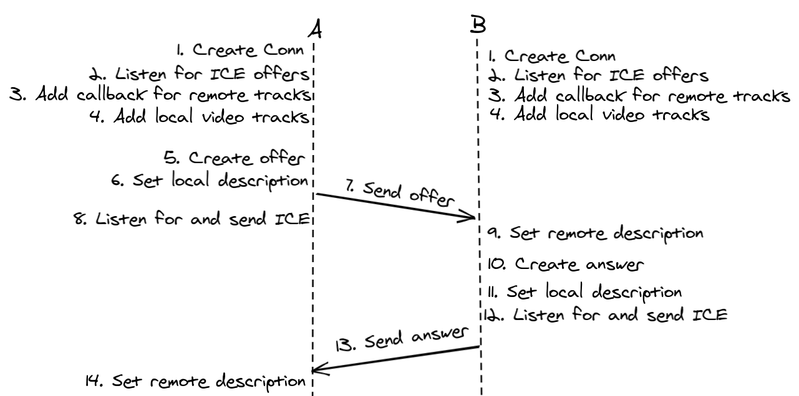
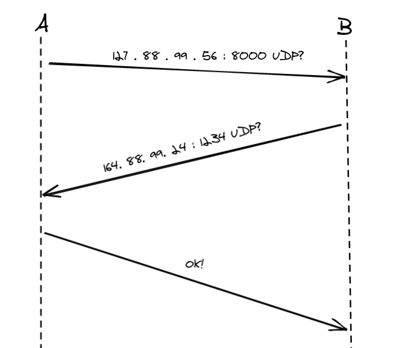
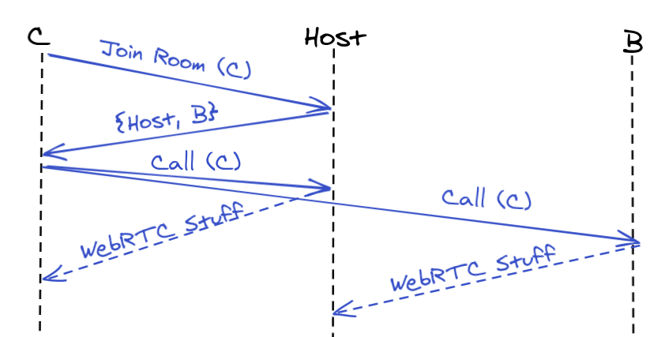

Recently I made an [app](https://mooz.cronokirby.com) for making group video calls.
The difference between this and something like zoom is that there's no central server
responsible for routing video calls between the participants. Instead,
I used [WebRTC](https://webrtc.org/) in order to set up peer-to-peer (P2P) calls between
all of the members of a group.
<!--more-->

This app was a good excuse for me to learn the basics of WebRTC, something I had been
wanting to do for quite a while.

You can visit it [here](https://mooz.cronokirby.com), and check out [the source](https://github.com/cronokirby/mooz). It works in a pretty straightforward
way. First you create a room, and then you send the link to the other members you want
to have a call with. When they click on the link, you'll be connected together,
and you can start chatting. You also have a mute button, which does what it says on the
tin, and a "stop camera" button, which replaces your video feed with a cute anime girl.

# What is WebRTC?

WebRTC is actually quite a few disparate things. It stands for "Web Real Time Communication",
and that tells us a lot about what it's meant to do. Basically, it's a browser
specification / API that was designed to allow users on the web to setup of real time communication
between eachother in a P2P fashion.

This means being able to stream audio and video to eachother, but also simpler things like just
setting up a data channel to send raw bytes. Here I just stuck with the video channels it provided,
to not have to worry about things like video encoding and what not myself. Data channels
are also quite useful for projects like [WebTorrent](https://webtorrent.io/) which adapts
the P2P bittorrent protocol to the web, using WebRTC.

There are quite a few details that are interesting if you want to understand how 
WebRTC works under the hood. They aren't important to understand how to use WebRTC,
and I won't really cover them in this post.

One thing that's interesting is that it's not actually that easy to directly connect
two users over the internet, because of things like NAT, where the router hides your
real IP address, along with firewalls, etc. A lot of WebRTC involves finding
ways to circumvent these, in order to open channels along which communication can take
place. These are the so called "STUN" and "TURN" servers.

## Signalling Servers

Another thing you need is some kind of way for users to coordinate before the direct
line of communication is established. This "way" is called a *signalling server*,
and its protocol isn't actually set by WebRTC.

This is somewhat of a good thing, because all this service needs to do is to be able
to forward messages from `A` to `B`, and not specifying it means that you're free to
set it up in different ways.

The API you need in the application is just two simple functions, essentially:

```scala
send(msg, to: ID)
onMsg(to: ID, cb: Msg => Unit)
```

You need a way to send messages to some arbitrary identifier, and to listen to incoming
messages associated with an identifier (yours).


There are different ways of implementing this. One popular way is to use *websockets*,
which allow you to easily listen to incoming messages. Another way is to poll a server
for new messages periodically, although I had trouble getting this to work without losing
messages.

I knew I wanted to deploy with [vercel](vercel.com), which meant going with a serverless
approach. That's why I ended up going with [Pusher](https://pusher.com/), which
essentially provides "websockets as a service". You can subscribe to events based on
an identifier, and push to a channel based on the same identifier, which is all we
need for coordinating users.

# Setting up a connection

Initially, to learn how WebRTC worked, I did all of the work manually. That is,
I just used the API WebRTC provides, instead of using a helper library.

The process of setting up a connection is somewhat involved, but each step is pretty simple.



## Getting Ready

Each Peer does the following things to get ready:

- Create an `RTCPeerConnection`, which is the class allowing us to interact with a peer
- Listen for ICE offers
- Add a callback for when the peer starts streaming video
- Add the local video streams to this connections, so our peer will be able to receive them

## ICE?

An ICE candidate is more or less just a way of describing a channel we can use as a P2P
connection. Each peer proposes ICE candidates to the other, until they managed to settle
on a single candidate that will work out for both of them:



## Code for this

You can look at the code I had for negotiating offers [here](https://github.com/cronokirby/mooz/blob/1f6b36604b6b733ce4d7755ed0591698a933d0c6/src/frontend/calling.ts). Note that I didn't consider creating the connection in point 1
as a "step", so the indices are offset by one here.

# Simple Peer

This process is tedious as is, but there's also extra work needed to handle failures,
retries, and other things like that. Because of that, I decided to use a helper
library: [simple-peer](https://github.com/feross/simple-peer).

simple-peer abstracts over this whole connection process. All you need to do is add
a callback to handle messages that a peer generates, and that you need to send across
the pipe you've set up, and to listen to messages and notify simple-peer when they arrive.
You register a callback for when a video stream is setup.

Doing it this way avoids a lot of repeat work, that you'd have to do anyways. I'm still
glad that I first went through implementing it myself, that way I got a better understanding
of how WebRTC works. But for the actual app, it's better to use something like simple-peer,
since other applications have been reliably built on it.

# Multiple Streams

At this point I've gone over how it works in the simple case, where you're just setting
up a single video stream with another person:


My approach for setting up multiple streams was the simplest, but works decently enough.
The idea is to setup a video call for each other peer you want to stream with, like so:


This scales with `O(n^2)`, so not as well as a central server, where each peer
only needs a single connection. On the other hand, this is much easier to implement.
I've heard of other techniques, like using a "tree based" broadcast, but I haven't
investigated those so far.

# Room Protocol

To setup these group calls, I had to make a little protocol in addition to the WebRTC
signalling messages. Thankfully I could reuse the signalling service for transmitting
these messages, I just had to add another layer over just the signalling data.

The idea is that a single user is identified as the "host" of a room (the user
that creates the room) and they have the same identifier of the room. When you join a meeting
with a link, you know the identifier of the room you want to join, and thus the person
you need to contact with the first message.

The exchange look likes this:



As before (although I didn't mention it) you make sure to annotate your messages with
your identifier, so that the other peers know how to reply to you.

Every user has a map from identifiers to the simple-peer object. These are the connections
it's currently maintaining. First you contact
the host, which then replies to you with all of the keys of their map, along with their
own identifier. These are all of the users currently in the group call. For each of
these identifiers, you send them a "call" message, and create a simple-peer object ready
to accept their WebRTC call. They respond to you by initiating a standard WebRTC call,
as before.

And that's all there is to it. There are some potential edge cases that might not work too
well, like when multiple people connect at the same time. You might need to run additional syncing afterwards
to fill in the missing connections if they occurr, but I haven't really looked into that yet.

# Muting

Muting was something that seemed tricky at first, but was actually pretty easy.
The `MediaStream` object, which is what you get back from simple peer, and what you use
to play the video and audio from the other side, has a `getAudioTracks()` function.
This method returns a list of all the audio tracks on the stream. You can mute a track
by setting the `.enabled` property.

# Hiding Video Streams

Another tricky thing was the "hide camera" button:


Clicking this button replaces your video stream with a cute anime girl:


The way I got this to work was by having a video element with `cuteanimegirl.mp4`
as its source always present on the page. I gave it a width of 0, so you can't actually
see it, and I muted the video as well. WebRTC provides a `.captureStream` method on
video elements, so you can use that to get the `MediaStream` coming from this element.

Once you have an alternate stream you'd like to use, you can use simple-peer's `replaceTrack` method.
This will inform the other peer of the new video stream, and start streaming that to them.
Of course, you need to do this for each peer connection you have.

You also want to change the local video stream, shown at the bottom right of the window.

# Footnote

I hope this was an interesting post, and was easily understandable without already knowing
about WebRTC. I encourage you to check out [the project](https://mooz.cronokirby.com),
read [its source](https://github.com/cronokirby/mooz) as well as the [WebRTC docs](https://webrtc.org/)
if it sparks your interest as well :).